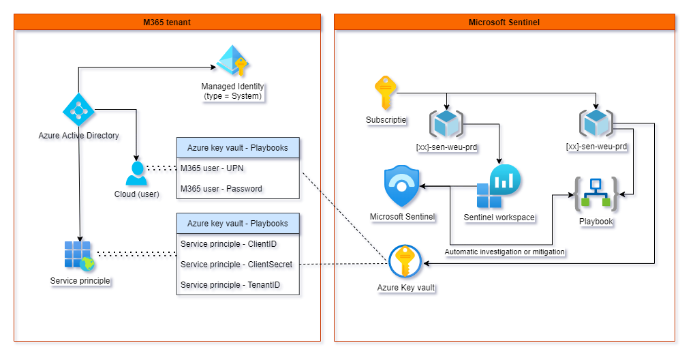
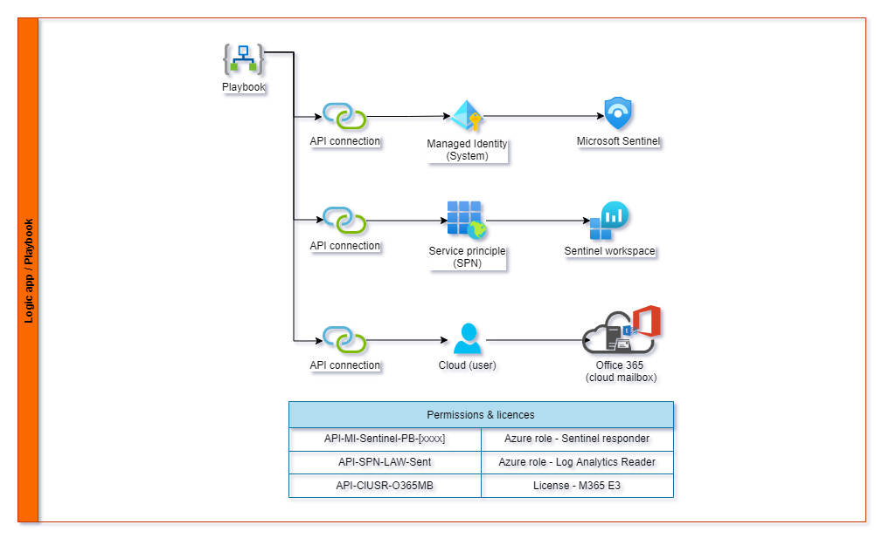

# Introduction deployment Playbooks by code

The deployment of LogicApps (Sentinel Playbooks) can be implemented through code. It makes it easier for the Sentinel automation contributors to develop new SOAR capabilities in the platform without knowledge of Azure and M365 permission structures. LogicApps are object-oriented scripts executing multiple steps to escalate or close security incidents. Permissions are configured via API connectors. These use techniques such as Managed identities of service principles. In the screenshots below you can see the high level design plans.





### Preperation & parameters

The Azure/M365 administrator must prepare the Cloud -environment before the Sentinel administrators can import the LogicApp templates. The preparation consists of a one-time creation of an Azure KeyVault and a Service Principle (including secretID). Keep in mind that the SecretID expires 1-year after creation (by default).

```PowerShell
$CustSn = "TVO" ##Shortname - example Tristan van Onselen
$RG_Kvname = $CustSn + "-sentinel-weu-prd"
$AzAdGroupName = $CustSn + "-sentinel-deployment"
$resourceGroupName = (Get-AzResourceGroup -Name "*playbook*").ResourceGroupName
$location = "westeurope"
$vaultName = $RG_Kvname
$Appregname = $CustSn + "-sentinel-ai-law"
```

### Permissions and roles

Using a deployment template simplifies the configuration process; for example, forgetting to set the permissions correctly is no longer an issue. However, LogicApps use various systems, so permissions must be configured in Azure and M365. The following overview shows which rights (and groups) are used.

| Component               | M365/Azure | Permissions during (one-time) deployment | Template deployment                       |
| ----------------------- | ---------- | ---------------------------------------- | ----------------------------------------- |
| Azure KeyVault          | Azure      | Key Vault Administrator                  | Azure Key Vault Secrets User (Get)        |
| Service principle (SPN) | M365       | Cloud application administrator          | Not applicable                            |
| Microsoft Sentinel      | Azure      | Not applicable                           | Microsoft Sentinel Automation Contributor |
| Azure subscription      | Azure      | User Access Administrator                | User Access Administrator                 |
| Azure Active Directory  | M365       | Group Administrator                      | not applicable                            |
| Azure Subscription      | Azure      | Contributor                              | Not applicable                            |

- DD.1 - A keyvault is used to securely store the sensitive tenant information. It also unlocks the capability to reuse the LogicApp templates in multiple tenant environments like test and production.
- DD.2 - The keyvault feature Azure Resource Manager for template deployment is enabled to support deployment by code.
  - R.1 - We recommend using a group that has rights to all components, this group can be used in conjunction with PIM groups to acomplisch least priviled access model. The PIM-able Azure Active Directory groups must enabed during creation of the goup.
- DD.3 - The naming convention of this group is [tenantShortName]-Sentinel-deployment.

#### How to deploy Azure Active Directory Groups (see permissions -> component -> Azure Active Directory)

```PowerShell
$AzAdGroupName = $CustSn + "-sentinel-deployment" ## change this to your preffered naming convention
$rgAzADGroup = Get-AzADGroup -DisplayName "$AzAdGroupName" -ErrorAction SilentlyContinue

if ($rgAzADGroup) {
    Write-Host "RG Azure Active Directory group; already exists"
} else {
    Write-Host "RG does not exist, attempting to create one"
    try {
        $rgAzADGroup = new-AzADGroup -DisplayName "$AzAdGroupName" -MailNickName "$AzAdGroupName" -Description "Assign permissions to members to deploy Playbooks" -ErrorAction Stop
    }
    catch {
        Write-Error $_.Exception.Message
        break
    }
}
```

#### How to deploy Resource group (see permissions -> component -> Azure Subscription)

```PowerShell
$rg = Get-AzResourceGroup -Name "$resourceGroupName" -ErrorAction SilentlyContinue

if ($rg) {
    Write-Host "RG already exists"
} else {
    # Create new RG
    Write-Host "RG does not exist, attempting to create one"
    try {
        $rg = New-AzResourceGroup -Name $ResourceGroupName -Location $location -ErrorAction Stop
    }
    catch {
        Write-Error $_.Exception.Message
        break
    }
}
```

#### How to deploy Azure KeyVault (see permissions -> component -> Azure KeyVault & Service Principle)

```PowerShell
$keyvaultResult = Get-AzKeyVault -ResourceGroupName $rg.ResourceGroupName -VaultName $vaultName -ErrorAction SilentlyContinue
if ($keyvaultResult) {
    Write-Host "Keyvault already exists"
} else {
    Write-Host "Keyvault does not exist, attempting to create one"
    try {
        New-AzKeyVault -Name $vaultName -ResourceGroupName $rg.ResourceGroupName -Location westeurope -EnabledForDeployment -EnabledForTemplateDeployment -ErrorAction Stop
    }
    catch {
        Write-Error $_.Exception.Message
        break
    }
}

Write-Host "Setting vault access policies"
try {
    Set-AzKeyVaultAccessPolicy -ResourceGroupName $rg.ResourceGroupName -VaultName $vaultName -ObjectId $rgAzADGroup.ID  -PermissionsToSecrets get -PermissionsToKeys list -PermissionsToCertificates list  -BypassObjectIdValidation
}
catch {
    Write-Error $_.Exception.Message
    break
}

write-host "Create App registration"
$SPN = get-AzADServicePrincipal -DisplayName $Appregname -ErrorAction SilentlyContinue
if ($SPN) {
    Write-Host "The service principle |  $AppregName already exists"
} else {
    try {
        #Create new SPN
        New-AzADServicePrincipal -DisplayName "$AppRegName"
        $SPNID = Get-AzADServicePrincipal -DisplayName "$AppRegName"
        $Key = New-AzADSpCredential -ObjectId ($SPNID).id
        $SecretID = ConvertTo-SecureString -String ($Key).SecretText -AsPlainText -Force

        #Add to keyvault
        set-AzKeyVaultSecret -VaultName $vaultName -Name "SPN-API-LogAnalytics-sec" -SecretValue $SecretID
        $AppClientID = ConvertTo-SecureString -String $SPNID.AppId -AsPlainText -Force
        set-AzKeyVaultSecret -VaultName $vaultName -Name SPN-API-LogAnalytics-ID -SecretValue $AppClientID
        $TenantID = ConvertTo-SecureString -String (get-AzContext).Tenant.id -AsPlainText -Force
        set-AzKeyVaultSecret -VaultName $vaultName -Name "SPN-API-LogAnalytics-TenentID" -SecretValue $TenantID

        #Assign AZ permissions to SPN
        $servicePrincipal = get-AzADServicePrincipal -DisplayName "WC7-Sentinel-AI-LAW"
        New-AzRoleAssignment -RoleDefinitionName "Log Analytics Reader" -ApplicationId $servicePrincipal.AppId
    }
    catch {
        Write-Error $_.Exception.Message
        break
    }

}
```

### Permissions - Template support for API connections and permissions

| LogicApp Component | Type of authentication  | Roles and permissions                | Naming convention (API-Connection) |
| ------------------ | ----------------------- | ------------------------------------ | ---------------------------------- |
| Microsoft Sentinel | Managed System Identity | Azure - Microsoft Sentinel responder | MicrosoftSentinel-[playbookname]   |
| Azure Monitor Logs | Service Principle Name  | Azure - Log Analytics Reader         | Azuremonitorlogs-[playbookname]    |

- DD.4 - By using the LogicApp template, the API connections are automatically made and the permissions are distributed as described above.
- R.2 - The permissions are set during the LogicApp deployment. Therefore user must have the Azure role User Access Administrator, Azure Contributor or Onwer. We recommend using a CI/CD pipeline, the user don't need to have the permissions assigned to his/her account but can run the code via a pipeline (Incl. auditlogging and code-validation).

## Service principle settings

Name WC7-Sentinel-AI-LAW


# Notes

Link - https://github.com/Azure/Azure-Sentinel/tree/master/Tools/Playbook-ARM-Template-Generator
LInk - https://abriones.home.blog/2019/08/01/logicappserviceprincipalarm/

### How to; deploy the watchlist

```PowerShell
New-AzResourceGroupDeployment -Name testing -ResourceGroupName "nf-sentinel-weu-prd" -TemplateFile .\Prep\Sent-Watchlist.json -WorkspaceName "nf-Tristan-sent-weu-prd"
```

### How to; deploy the playbook

```PowerShell
New-AzResourceGroupDeployment -Name Deploy-Playbook -ResourceGroupName "nf-sentinel-weu-prd" -TemplateFile .\playbook\ai-sentinel-bypass-conditional-access-rule-in-Azure-AD\azuredeploy.json
```

### Issues

No known issues
